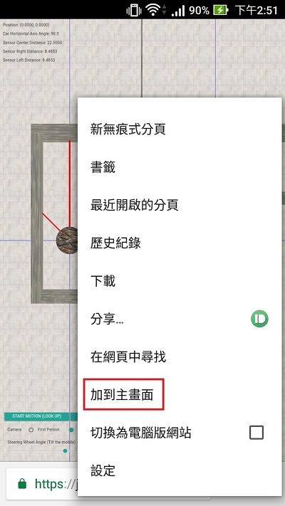
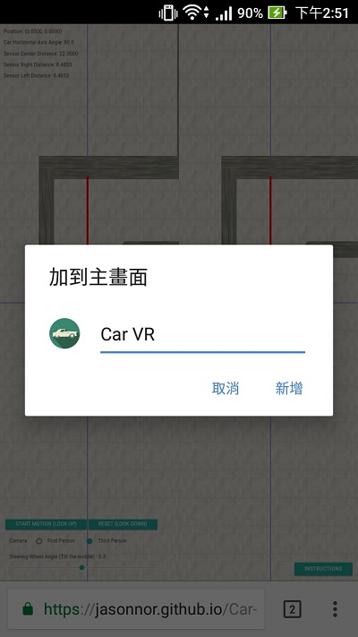
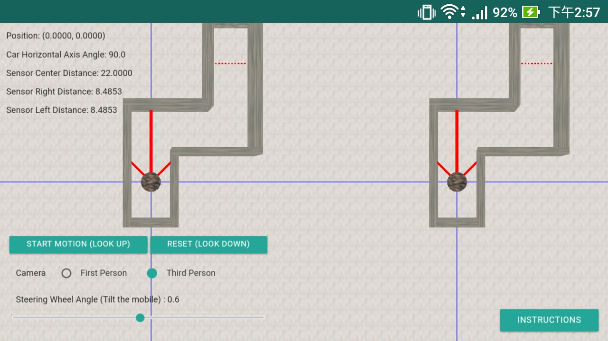
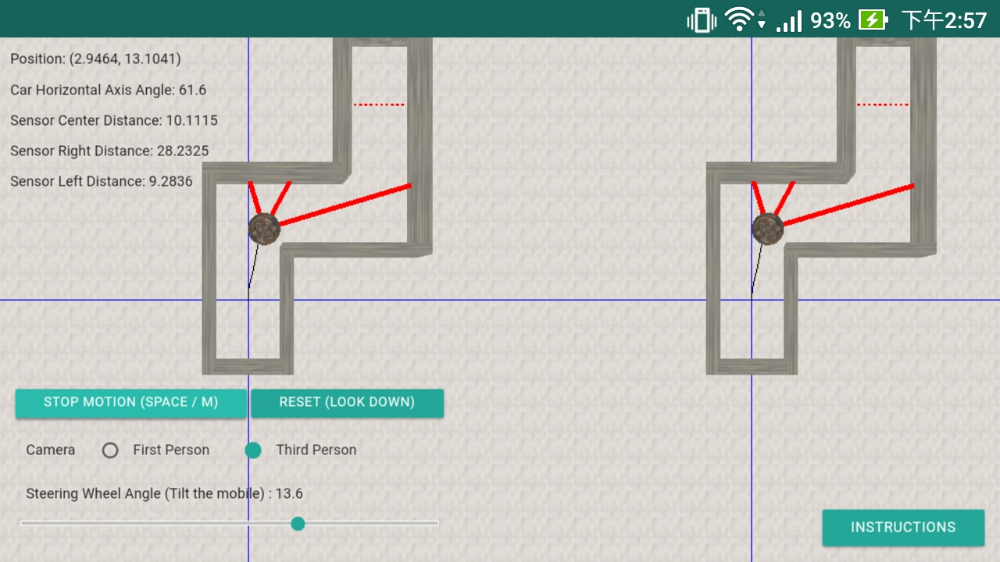
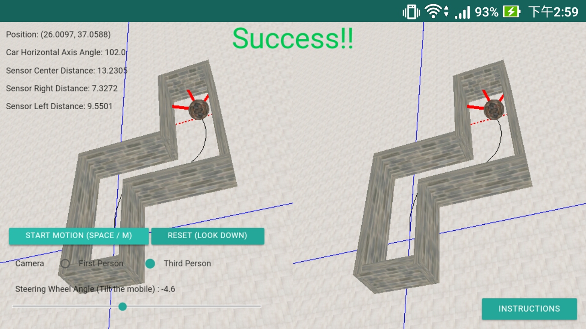
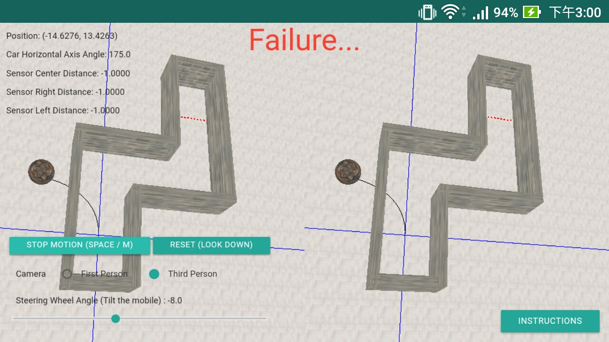

# [Car Simulator VR](https://jasonnor.github.io/Car-Simulator/WebVR)

Car Simulator VR can be controlled using a VR device.

## Getting Started

1. Open this [page](https://jasonnor.github.io/Car-Simulator/WebVR) with your mobile browser (suggested for Google Chrome)

2. Click the toolbar, select "Add to homescreen" and press "Add"

 

3. You will be able to see Car VR Web App on homescreen, click to enter

 

4. The screen will automatically become horizontal screen, then you can use the VR device to experience

## Instructions

Use the headset VR device to tilt the head (or the phone) to control the steering wheel, and looking up to start motion or pause, looking down to reset coordinates. Press the button on the screen to switch the first-person or third-person camera perspective. You can control the camera with your finger (single finger for rotation, double finger for zoom, three finger for translation).

## Preview

## Reference

+ three.js - [https://threejs.org/](https://threejs.org/)
+ FileSaver.js - [https://github.com/eligrey/FileSaver.js/](https://github.com/eligrey/FileSaver.js/)
+ Materialize - [http://materializecss.com/](http://materializecss.com/)

## Contributing

Please feel free to use it if you are interested in fixing issues and contributing directly to the code base.

## License

Car Simulator is released under the MIT license. See the [LICENSE](/LICENSE) file for details.
